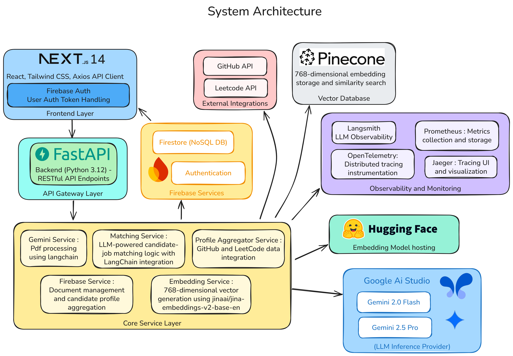

# VSmart Backend

An intelligent backend service that leverages AI for resume parsing, candidate-job matching, and comprehensive developer profile aggregation from multiple platforms including GitHub and LeetCode.

## 🚀 Quick Start

To get the entire backend up and running with all monitoring services:

```powershell
docker compose up -d
```

This will start all services in the background. Once running, you can access:

### 📊 Service UIs
- **Backend API**: http://localhost:8000
  - **API Documentation (Swagger)**: http://localhost:8000/docs
  - **ReDoc Documentation**: http://localhost:8000/redoc
- **Jaeger Tracing UI**: http://localhost:16686
- **Prometheus Metrics**: http://localhost:9090
- **OpenTelemetry Collector**: http://localhost:8889

### 🛑 Stop Services
```powershell
docker compose down
```

---

## System Architecture



The VSmart Backend follows a modular, microservices-inspired architecture with the following key components:

- **FastAPI Application Layer**: RESTful API endpoints with automatic OpenAPI documentation
- **AI-Powered Services**: Google Gemini integration for intelligent resume parsing and job matching
- **Data Integration Layer**: GitHub and LeetCode profile aggregation with caching
- **Storage Layer**: Firebase Firestore for structured data and Pinecone for vector embeddings
- **Observability Stack**: OpenTelemetry, Jaeger tracing, and Prometheus metrics
- **Containerized Deployment**: Docker and Docker Compose for easy deployment and scaling

## Project Structure

```
vsmart-backend/
├── app/
│   ├── main.py                 # FastAPI application entry point
│   ├── config.py               # Environment configuration and API keys
│   └── observability/          # Monitoring and telemetry setup
│       ├── logging_config.py
│       ├── metrics.py
│       └── tracing.py
│
├── api/
│   ├── auth.py                 # Authentication middleware
│   ├── routes/                 # API endpoint definitions
│   │   ├── resume.py           # Resume upload and parsing endpoints
│   │   ├── match.py            # Resume-job matching endpoints
│   │   ├── profile.py          # Developer profile aggregation
│   │   ├── github.py           # GitHub integration endpoints
│   │   ├── job_description.py  # Job description management
│   │   ├── candidate.py        # Candidate management
│   │   ├── chatbot.py          # AI chatbot interactions
│   │   └── health.py           # Health check and monitoring
│   └── schemas/                # Pydantic models for request/response
│       ├── resume.py
│       ├── match.py
│       ├── profile.py
│       ├── github.py
│       ├── job_description.py
│       └── candidate.py
│
├── services/                   # Core business logic services
│   ├── gemini.py               # Google Gemini AI integration
│   ├── matcher.py              # AI-powered resume-job matching
│   ├── github.py               # GitHub API client and data processing
│   ├── leetcode.py             # LeetCode profile scraping
│   ├── profile_aggregator.py   # Multi-platform profile aggregation
│   ├── embedding.py            # Vector embedding generation
│   ├── pinecone_service.py     # Vector database operations
│   ├── firestore.py            # Firebase Firestore operations
│   ├── firebase.py             # Firebase initialization
│   ├── job_description.py      # Job description processing
│   ├── analytics.py            # Analytics and insights generation
│   └── chatbot.py              # AI chatbot service
│
├── prompts/                    # AI prompt templates
│   ├── gemini/                 # Gemini-specific prompts
│   ├── job_description/        # Job parsing prompts
│   └── matcher/                # Matching analysis prompts
│
├── data/                       # Data storage
│   ├── resumes/                # Uploaded resume files
│   └── job_descriptions/       # Job description files
│
├── tests/                      # Test suites
│   ├── test_resume.py
│   ├── test_match.py
│   ├── test_profiles.py
│   └── test_api_basic.py
│
├── docs/                       # Documentation
├── docker-compose.yml          # Multi-service orchestration
├── Dockerfile                  # Container definition
├── requirements.txt            # Python dependencies
└── observability configs/      # Monitoring configuration
    ├── jaeger.yaml
    ├── prometheus.yml
    └── otel-collector-config.yml
```

## Core Features

### 🧠 AI-Powered Resume Parsing
- **Multi-format Support**: PDF, DOCX, and image-based resume parsing
- **Google Gemini Integration**: Advanced AI extraction of structured data from unstructured resumes
- **Rich Data Extraction**: Skills, experience, education, projects, and personal information
- **Vector Embeddings**: Generate semantic embeddings for similarity search and matching

### 🎯 Intelligent Job Matching
- **AI-Driven Analysis**: Compare resumes against job descriptions using advanced NLP
- **Skill Gap Analysis**: Identify missing skills and provide recommendations
- **Compatibility Scoring**: Generate detailed matching scores with explanations
- **Requirements Mapping**: Map candidate experience to specific job requirements

### 👨‍💻 Developer Profile Aggregation
- **GitHub Integration**: 
  - Repository analysis and contribution patterns
  - Programming language proficiency assessment
  - Project complexity evaluation
  - Collaboration and code quality metrics
- **LeetCode Integration**:
  - Problem-solving statistics and rankings
  - Algorithm and data structure proficiency
  - Contest performance and achievements
  - Skill progression tracking

### 🔍 Candidate Discovery & Analytics
- **Profile Search**: Semantic search across candidate profiles using vector embeddings
- **Talent Pool Analytics**: Aggregate insights across candidate database
- **Skill Distribution**: Analyze skill trends and market demands
- **Performance Metrics**: Track platform usage and success rates

### 🤖 AI Chatbot Assistant
- **Interactive Queries**: Natural language interface for data exploration
- **Candidate Insights**: Get AI-powered insights about specific candidates
- **Job Recommendations**: Suggest optimal job matches based on candidate profiles
- **Market Intelligence**: Ask questions about hiring trends and skill demands

### 🔐 Authentication & Security
- **Firebase Authentication**: Secure user management and access control
- **Role-based Access**: Different permission levels for recruiters, candidates, and admins
- **Data Privacy**: Compliant with data protection regulations
- **Secure API**: Token-based authentication for all endpoints

## Setup and Installation

### Prerequisites
- Python 3.12+
- Docker and Docker Compose
- Google Cloud Platform account (for Gemini AI)
- Firebase project (for authentication and Firestore)
- GitHub Personal Access Token
- Pinecone account (for vector database)

### Environment Setup

1. **Clone the repository**:
   ```powershell
   git clone <repository-url>
   cd vsmart-backend
   ```

2. **Create a virtual environment**:
   ```powershell
   python -m venv venv
   venv\Scripts\activate
   ```

3. **Install dependencies**:
   ```powershell
   pip install -r requirements.txt
   ```

4. **Environment Configuration**:
   Create a `.env` file with the following variables:
   ```env
   # AI Services
   GEMINI_API_KEY=your_gemini_api_key
   GEMINI_MODEL=gemini-2.5-pro
   
   # GitHub Integration
   GITHUB_API_TOKEN=your_github_personal_access_token
   
   # Firebase Configuration
   FIREBASE_CREDENTIALS_PATH=./firebase-credentials.json
   FIRESTORE_PROJECT_ID=your_firestore_project_id
   
   # Vector Database
   PINECONE_API_KEY=your_pinecone_api_key
   PINECONE_INDEX_NAME=your_index_name
   
   # Observability (Optional)
   LANGSMITH_API_KEY=your_langsmith_api_key
   LANGSMITH_PROJECT=vsmart-backend
   LANGSMITH_TRACING=true
   ```

5. **Firebase Setup**:
   - Download your Firebase service account credentials
   - Save as `firebase-credentials.json` in the project root
   - Enable Firestore Database in your Firebase project

6. **Run the application**:
   ```powershell
   python -m app.main
   ```

### Docker Setup (Recommended)

For a complete setup with observability stack:

```powershell
# Start all services including Jaeger, Prometheus, and OTEL Collector
docker-compose up --build

# Access services:
# - Backend API: http://localhost:8000
# - API Documentation: http://localhost:8000/docs
# - Jaeger UI: http://localhost:16686
# - Prometheus UI: http://localhost:9090
```

## API Endpoints

### Resume Management
- `POST /api/resume/upload` - Upload and parse resume files (PDF, DOCX, images)
- `GET /api/resume/{resume_id}` - Retrieve parsed resume data
- `DELETE /api/resume/{resume_id}` - Delete resume and associated data

### Job Matching
- `POST /api/match/analyze` - Perform comprehensive resume-job matching analysis
- `POST /api/match/batch` - Batch process multiple resume-job combinations
- `GET /api/match/history/{user_id}` - Retrieve matching history for a user

### Developer Profiles
- `GET /api/profile/{username}` - Get aggregated developer profile (GitHub + LeetCode)
- `POST /api/profile/refresh` - Force refresh profile data from external sources
- `GET /api/profile/search` - Search profiles using semantic similarity

### GitHub Integration
- `GET /api/github/user/{username}` - Get GitHub user insights and repository analysis
- `GET /api/github/repositories/{username}` - Analyze user's repositories in detail
- `POST /api/github/webhook` - Handle GitHub webhook events for real-time updates

### Job Descriptions
- `POST /api/job-description/upload` - Upload and parse job description
- `GET /api/job-description/{jd_id}` - Retrieve parsed job description
- `POST /api/job-description/analyze` - Extract requirements and skills from JD

### Candidate Management
- `GET /api/candidate/search` - Search candidates with advanced filters
- `GET /api/candidate/{candidate_id}` - Get comprehensive candidate profile
- `POST /api/candidate/shortlist` - Add candidates to shortlist

### AI Chatbot
- `POST /api/chatbot/query` - Ask natural language questions about candidates or jobs
- `GET /api/chatbot/suggestions` - Get AI-powered suggestions for hiring decisions

### Analytics
- `GET /api/analytics/dashboard` - Get hiring analytics and insights
- `GET /api/analytics/skills` - Analyze skill trends in candidate pool
- `GET /api/analytics/market` - Get market intelligence and benchmarks

### System
- `GET /api/health` - Health check endpoint with service status
- `GET /api/metrics` - Prometheus-compatible metrics endpoint

## Development

### Running Tests
```powershell
# Run all tests
pytest

# Run specific test files
pytest tests/test_resume.py
pytest tests/test_match.py
pytest tests/test_profiles.py

# Run with coverage
pytest --cov=services --cov=api
```

### Code Quality
```powershell
# Format code
black .

# Lint code
flake8 .

# Type checking
mypy .
```

### Local Development with Hot Reload
```powershell
# Start with auto-reload for development
uvicorn app.main:app --reload --host 0.0.0.0 --port 8000
```

## Technology Stack

### Core Technologies
- **FastAPI**: High-performance Python web framework with automatic API documentation
- **Python 3.12+**: Latest Python features and performance improvements
- **Pydantic**: Data validation and serialization using Python type annotations
- **LangChain**: Framework for developing applications with language models

### AI & Machine Learning
- **Google Gemini**: Advanced multimodal AI for text and image understanding
- **OpenAI Embeddings**: Vector embeddings for semantic search and similarity
- **LangSmith**: LLM application observability and debugging

### Data Storage & Search
- **Firebase Firestore**: NoSQL document database for structured data
- **Pinecone**: Vector database for semantic search and similarity matching
- **Redis** (Optional): Caching layer for improved performance

### External Integrations
- **GitHub API**: Repository analysis and developer insights
- **LeetCode Scraping**: Programming skills assessment data
- **Firebase Auth**: User authentication and authorization

### Observability & Monitoring
- **OpenTelemetry**: Distributed tracing and metrics collection
- **Jaeger**: Distributed tracing visualization
- **Prometheus**: Metrics storage and alerting
- **Custom Logging**: Structured logging with correlation IDs

### Deployment & DevOps
- **Docker**: Containerization for consistent environments
- **Docker Compose**: Multi-service orchestration
- **OTEL Collector**: Telemetry data pipeline and processing


## Observability & Monitoring

The VSmart Backend includes a comprehensive observability stack for monitoring, tracing, and debugging:

### 🔍 Distributed Tracing with Jaeger
- **End-to-end Tracing**: Track requests across all services and external API calls
- **Performance Analysis**: Identify bottlenecks and optimize response times
- **Error Tracking**: Trace error propagation through the system
- **Dependency Mapping**: Visualize service dependencies and call patterns

### 📊 Metrics with Prometheus
- **Custom Metrics**: Track business-specific KPIs (resume processing, match accuracy)
- **System Metrics**: CPU, memory, and network usage monitoring
- **API Metrics**: Request rates, response times, and error rates
- **Alerting Rules**: Automated alerts for system anomalies

### 📝 Structured Logging
- **Correlation IDs**: Track requests across service boundaries
- **Contextual Information**: Rich logging with user context and request metadata
- **Log Aggregation**: Centralized logging for debugging and analysis
- **Performance Insights**: Detailed timing information for optimization

### 🚀 Getting Started with Observability

1. **Start the observability stack**:
   ```powershell
   docker-compose up --build
   ```

2. **Access monitoring dashboards**:
   - **API Documentation**: [http://localhost:8000/docs](http://localhost:8000/docs)
   - **Jaeger Tracing UI**: [http://localhost:16686](http://localhost:16686)
   - **Prometheus Metrics**: [http://localhost:9090](http://localhost:9090)

3. **Monitor application performance**:
   - View distributed traces for API requests
   - Analyze metrics and set up custom dashboards
   - Debug issues using correlated logs and traces

## Use Cases

### For Recruiters & HR Teams
- **Automated Resume Screening**: Process hundreds of resumes automatically with AI
- **Intelligent Candidate Matching**: Find the best candidates for specific roles
- **Technical Skill Assessment**: Evaluate programming abilities through GitHub and LeetCode analysis
- **Talent Pool Analytics**: Understand market trends and skill availability
- **Efficient Shortlisting**: Use AI insights to make faster hiring decisions

### For Candidates
- **Profile Enhancement**: Get insights on how to improve your developer profile
- **Skill Gap Analysis**: Understand what skills are needed for target roles
- **Market Positioning**: See how your profile compares to market demands
- **Career Guidance**: Receive AI-powered recommendations for career growth

### For Development Teams
- **Technical Hiring**: Assess coding skills and open-source contributions
- **Team Composition**: Find developers with complementary skills
- **Skill Distribution**: Analyze team capabilities and identify training needs
- **Benchmarking**: Compare internal talent with market standards

## Contributing

We welcome contributions! Please see our contributing guidelines:

1. **Fork the repository** and create a feature branch
2. **Write tests** for new functionality
3. **Follow code style** guidelines (Black, Flake8)
4. **Update documentation** for any new features
5. **Submit a pull request** with a clear description

### Development Setup for Contributors
```powershell
# Clone your fork
git clone https://github.com/yourusername/vsmart-backend.git
cd vsmart-backend

# Set up development environment
python -m venv venv
venv\Scripts\activate
pip install -r requirements.txt
pip install -r requirements-dev.txt

# Run tests
pytest

# Start development server
uvicorn app.main:app --reload
```

## License

This project is licensed under the MIT License. See the [LICENSE](LICENSE) file for details.

## Support

For support and questions:
- 📧 Email: support@vsmart.ai
- 📖 Documentation: [Full API Documentation](http://localhost:8000/docs)
- 🐛 Issues: [GitHub Issues](https://github.com/your-org/vsmart-backend/issues)
- 💬 Discussions: [GitHub Discussions](https://github.com/your-org/vsmart-backend/discussions)